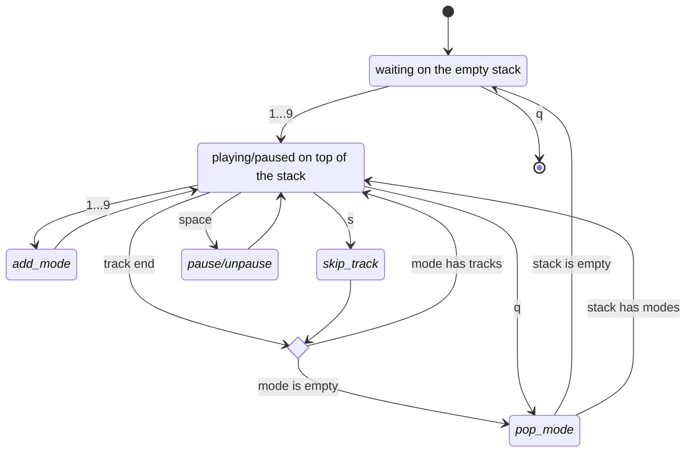

# ttmusic

A terminal ui music player for tabletop rpg sessions.

## State diagram

```mermaid
stateDiagram-v2
    classDef action font-style:italic

    init : waiting on the empty stack
    playing : playing/paused on top of the stack
    add : add_mode
    skip : skip_track
    pop : pop_mode
    switch : pause/unpause
    state track_end <<choice>>

    class add, skip, pop, switch action

    [*] --> init

    init --> [*] : q
    init --> playing : 1...9

    playing --> add : 1...9
    add --> playing

    playing --> track_end : track end
    track_end --> pop : mode is empty
    track_end --> playing : mode has tracks
    pop --> init : stack is empty
    pop --> playing : stack has modes

    playing --> skip : s
    skip --> track_end

    playing --> pop : q

    playing --> switch : space
    switch --> playing
```
